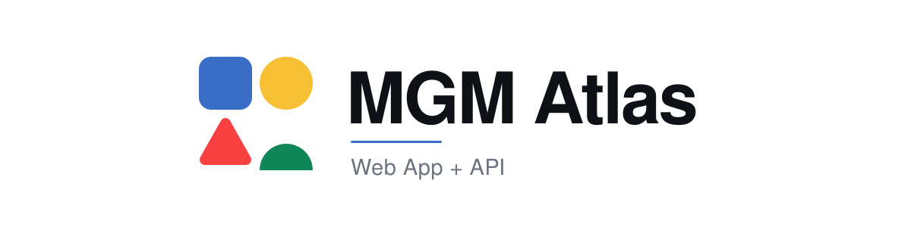
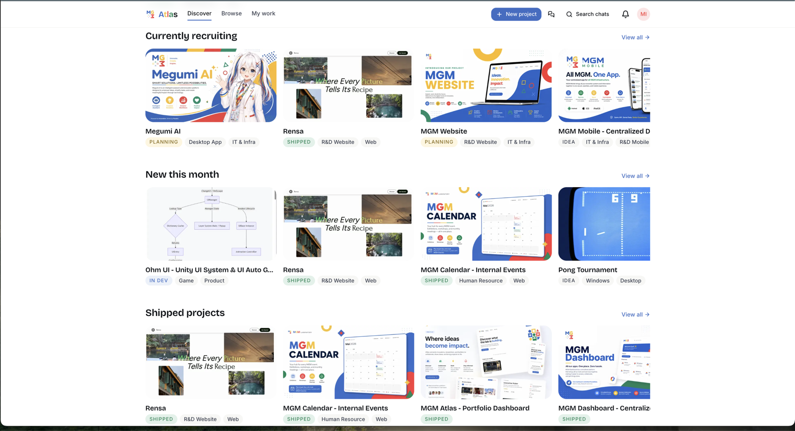
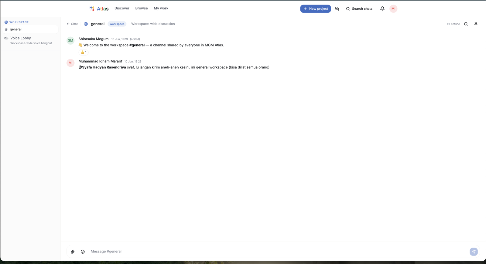
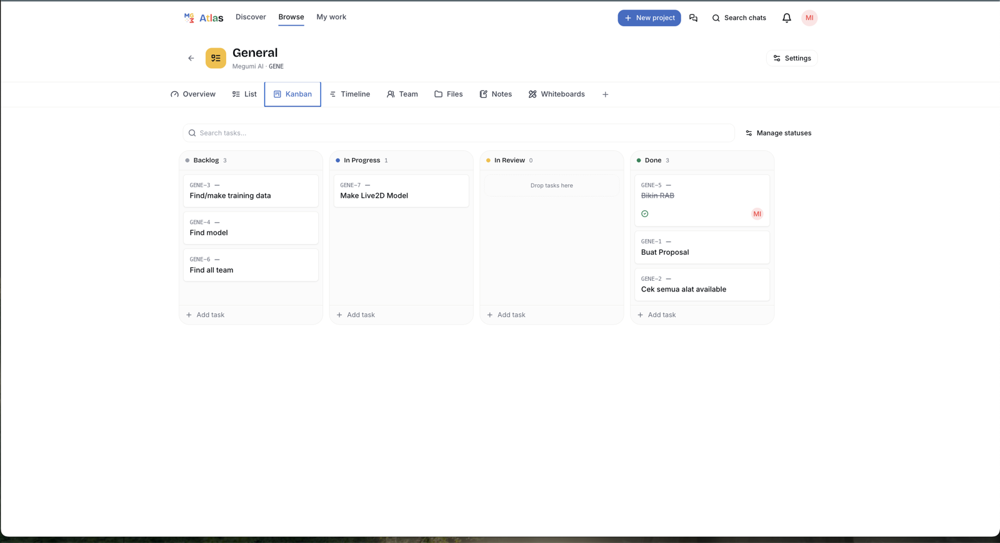
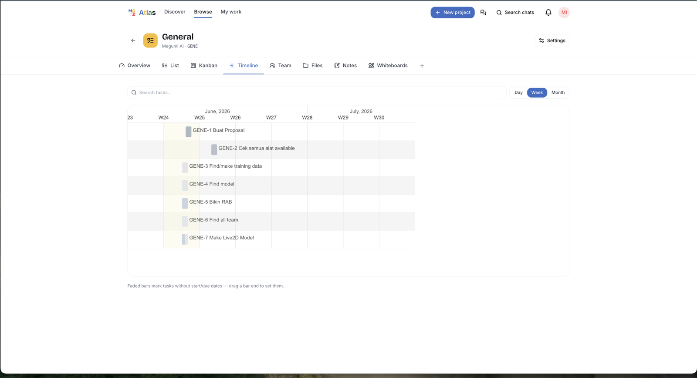
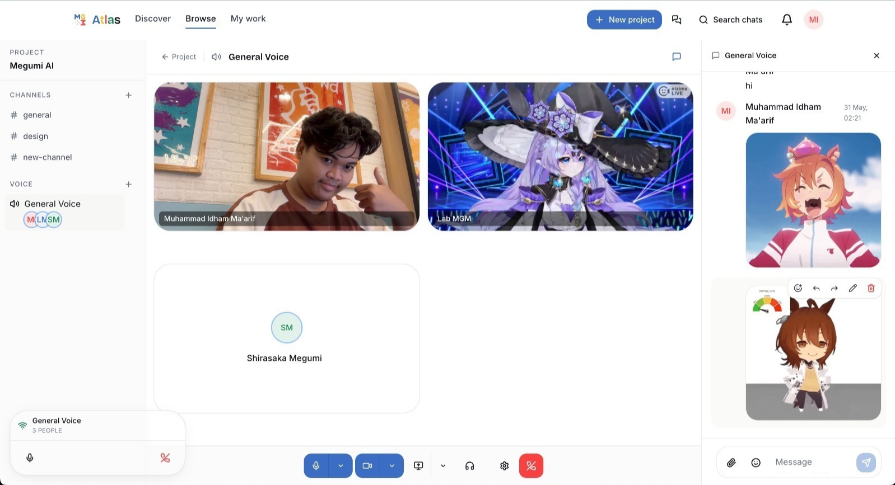
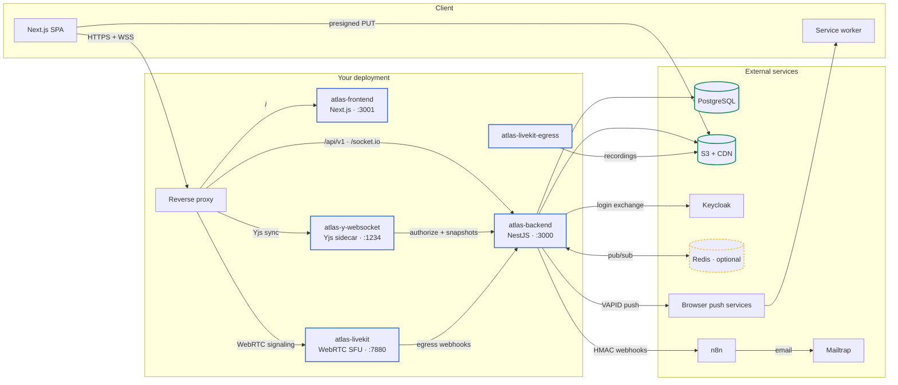
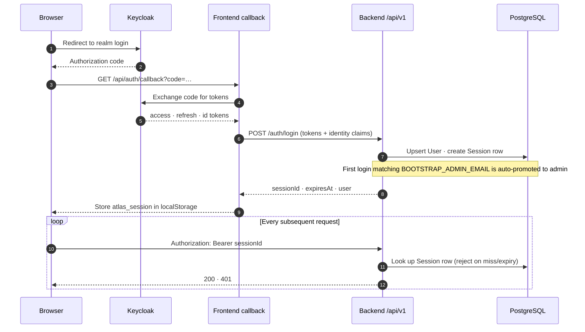

<a id="readme-top"></a>

<div align="center">

<picture>
  <source media="(prefers-color-scheme: dark)" srcset="docs/brand/banner-dark.svg">
  
</picture>

<p><em>Your lab's project HQ — portfolio, chat, tasks, and voice in one place, so you don't have to pay for Jira <strong>and</strong> Slack anymore.</em></p>

<p>
  <a href="https://github.com/shirasakaren/rement/actions/workflows/ci-frontend.yml"></a>
  <a href="https://github.com/shirasakaren/rement/actions/workflows/ci-backend.yml"></a>
  <a href="https://atlas.labmgm.org/health"></a>
  <a href="LICENSE"></a>
</p>

<p>
  <a href="https://nextjs.org"></a>
  <a href="https://nestjs.com"></a>
  <a href="https://www.prisma.io"></a>
  <a href="https://www.typescriptlang.org"></a>
  <a href="https://livekit.io"></a>
</p>

<p>
  <a href="https://atlas.labmgm.org"><strong>Live App</strong></a> ·
  <a href="#-feature-tour">Feature Tour</a> ·
  <a href="#-using-atlas">User Guide</a> ·
  <a href="#-getting-started">Getting Started</a> ·
  <a href="#-architecture">Architecture</a> ·
  <a href="#-api-surface">API</a>
</p>

</div>


## 🧭 What is MGM Atlas?

MGM Atlas is the **self-hosted project HQ** of [MGM Laboratory](https://mgm.ub.ac.id), a software lab at Universitas Brawijaya. Instead of paying for four tools and losing the team between tabs, the lab runs one app where projects are showcased, discussed, planned, and shipped:

| | Pillar | Feels like |
|---|---|---|
| 📁 | **[Portfolio & Discovery](#-portfolio--discovery)** — every lab project, browsable and beautiful | Netflix |
| 💬 | **[Chat](#-chat)** — workspace + per-project channels, reactions, GIFs, pins | Slack |
| ✅ | **[PMO](#-pmo--tasks-boards-notes-whiteboards)** — lists, kanban, gantt, notes, whiteboards, files | ClickUp |
| 🎙 | **[Voice](#-voice)** — voice/video rooms with screen share and stages | Discord |

This repository is a **pnpm monorepo** holding the whole product:

- [`apps/frontend`](apps/frontend) — the Next.js 15 web client (thin SPA over the API).
- [`apps/backend`](apps/backend) — the NestJS 10 API: REST under `/api/v1`, three Socket.IO namespaces, 15 feature modules, 41 controllers, and 48 Prisma models on PostgreSQL.
- [`docs/`](docs) — architecture, deployment, design system, and ops runbooks.
- One CI/CD pipeline, one `docker-compose.yml`, one `.env.example`, one consolidated database migration — the two apps ship and roll back together.

## ✨ Feature Tour

### 📁 Portfolio & Discovery

Projects are first-class citizens: hero media, tech stacks, phases, team rosters, and a discovery dashboard that surfaces what the lab is building right now.


<details>
<summary>More portfolio screenshots</summary>

| | |
|---|---|
|  |  |
| *Browse with filters & status badges* | *Project tabs: overview to whiteboards* |

</details>

### 💬 Chat

A workspace-wide `#general`, a channel per project, and everything you'd expect from a modern messenger: replies, reactions, pins, forwarding, GIFs, stickers, link previews, attachments, and full-text search.



### ✅ PMO — tasks, boards, notes, whiteboards

Each project gets task lists with custom statuses, a kanban board, a Gantt timeline, collaborative notes, Excalidraw whiteboards, a file manager, and even embedded external tools — all live-synced between teammates.

| | |
|---|---|
|  |  |
| *Drag-and-drop kanban* | *Gantt timelines* |

### 🎙 Voice

Discord-grade rooms: voice, camera, 1080p60 screen share, per-participant volume, soundboard, moderated stage channels with hand-raise, and recordings — plus a workspace Voice Lobby.



<p align="right">(<a href="#readme-top">back to top</a>)</p>

## 📖 Using Atlas

A tour of the app as a lab member experiences it:

1. **Sign in** — one click takes you to the lab's Keycloak SSO; you come back signed in. No separate Atlas password.

   

2. **Discover** — the dashboard curates featured and recent projects Netflix-style; **Browse** adds search, tag filters, phases, and recruiting status.

3. **Create a project** — a 5-step wizard: basics → tags & tech stack → media gallery (drag-and-drop, uploads go straight to S3) → team & open roles → review.

4. **Build the team** — visitors *request to contribute* with a role and message; managers approve or invite people directly.

5. **Talk** — every project ships with `#general`; add channels as you grow. Mention with `@`, react, pin decisions, search everything later.

6. **Run the work** — open the project's **Lists** tab and pick your view: List, Kanban, Timeline, Notes, Whiteboards, Files, Team, or a custom embed. <kbd>Cmd</kbd>+<kbd>Z</kbd> undoes almost anything — it's server-backed, so it survives reloads.

7. **Hop on voice** — join a project room or the workspace Lobby. Defaults (all rebindable in voice settings):

   | Shortcut | Action |
   |---|---|
   | <kbd>Ctrl</kbd>+<kbd>Shift</kbd>+<kbd>M</kbd> | Toggle mute |
   | <kbd>Ctrl</kbd>+<kbd>Shift</kbd>+<kbd>D</kbd> | Toggle deafen |
   | <kbd>Ctrl</kbd>+<kbd>Shift</kbd>+<kbd>H</kbd> | Disconnect |

8. **Stay in the loop** — **My work** collects what you manage, contribute to, and saved; the bell and `/me/notifications` keep an inbox; browser push (with inline quick-reply) works even with Atlas closed.

Admins additionally get `/admin`: tag manager, featured curation, collaboration roles, user management, and sticker packs.

<p align="right">(<a href="#readme-top">back to top</a>)</p>

## 🛠 Tech stack

| Concern | Choice | Why |
|---|---|---|
| Web framework | **Next.js 15** (App Router) + **React 19 RC** | RSC layouts, typed routes, standalone output |
| API framework | **NestJS 10** | Module graph, guards, interceptors, Swagger |
| Language | **TypeScript 5.6** | `experimental.typedRoutes` keeps links honest |
| Styling | **Tailwind CSS 3.4** + design tokens | The entire identity lives in `tailwind.config.ts` |
| UI primitives | **Radix UI** + CVA wrappers in `components/ui/` | Accessible by default, skinned once, reused everywhere |
| Data | **TanStack Query 5** (client) · **Prisma 5 + PostgreSQL** (server) | 30 s staleTime; 48 models, 20 enums |
| Realtime | **Socket.IO 4** + **Yjs / y-websocket** | Chat/notifications/voice events + CRDT co-editing |
| Voice | **LiveKit** (SFU + egress) | WebRTC with screen share, recordings to S3 |
| Auth | **Keycloak OIDC** → opaque DB sessions | SSO with lab identity; no Atlas passwords |
| Motion / icons | **Framer Motion** + **Lucide** (stroke 2.25) | One icon language, restrained motion |

> [!WARNING]
> **Version pinning:** Next 15.0.7 and React 19 RC are pinned together — don't bump one without the other. `next-auth` is still in `apps/frontend/package.json` but **unused** (dead weight pending removal); never import from it.

## 🏛 Architecture

The API is one container, but voice, collaborative editing, and recording each run as sidecars that the backend orchestrates. Everything degrades gracefully: no Redis means single-instance sockets, no y-websocket means single-editor notes, no LiveKit means voice endpoints answer `503` — the core portfolio API never goes down with a sidecar.



| Compose service | Role | Port |
|---|---|---|
| `atlas-frontend` | The Next.js web app (standalone output) | `3001` |
| `atlas-backend` | The NestJS API (auto-runs `prisma migrate deploy` on boot) | `3000` |
| `atlas-y-websocket` | Yjs CRDT relay for collaborative notes & whiteboards | `1234` |
| `atlas-livekit` | WebRTC SFU for voice/video/screen share | `7880` + UDP/TCP media mux |
| `atlas-livekit-egress` | Records voice channels and uploads composites to S3 | — |

> [!NOTE]
> **PostgreSQL is always external** — docker-compose runs the app containers only, never a database. Keycloak, Redis, and n8n live on their own hosts too.

## 🔐 Authentication

Keycloak handles *identity*; the API issues its own *sessions*. The frontend redirects to Keycloak, exchanges the OAuth code, then trades the Keycloak tokens for an Atlas session:



> [!IMPORTANT]
> The bearer token is an **opaque session UUID** issued by `POST /auth/login` and looked up in the database on every request. It is **not** a Keycloak JWT. Route protection in the SPA is client-side (`(authenticated)/layout.tsx`).

Authorization is layered on top: a global auth guard (opt-out via `@Public()`), project role guards (`PROJECT_MANAGER` vs `CONTRIBUTOR`), project visibility (`PUBLIC` vs `PRIVATE`), and admin gates for curation and configuration endpoints.

<p align="right">(<a href="#readme-top">back to top</a>)</p>

## 📡 API surface

Everything lives under `/api/v1` and requires `Authorization: Bearer <sessionId>` unless marked **Public**. The canonical, always-current reference is **Swagger** at `http://localhost:3000/api/v1/docs` (non-production only).

| Module | Responsibility |
|---|---|
| `auth` | Keycloak token exchange → DB-backed sessions |
| `users` | Profiles, search, personal dashboard, bookmarks |
| `projects` | Portfolio CRUD, discovery, featured curation |
| `media` | Project gallery uploads via S3 presigned PUT |
| `tags` | Taxonomy (Phase / Stack / Domain), seeded defaults |
| `contributions` / `team` | "Request to join" workflow, invites, membership |
| `notifications` | In-app inbox + web push + quick reply |
| `chat` | Channels, messages, reactions, pins, search, GIFs |
| `pmo` | Tasks, kanban/gantt, notes, whiteboards, files *(flag-gated)* |
| `voice` | Voice/video/screen share via LiveKit *(flag-gated)* |
| `admin` / `webhooks` / `mailer` / `health` | Curation, outbound n8n events, readiness probe |

The full endpoint tables live in [`docs/architecture.md`](docs/architecture.md) — or just open Swagger against a dev deployment.

## 🗃 Data model

The Prisma schema (in [`apps/backend/prisma/schema.prisma`](apps/backend/prisma/schema.prisma)) holds **48 models and 20 enums** across identity, portfolio, chat, PMO, voice, and delivery. Worth knowing:

- **One consolidated migration** — the per-feature migrations the two apps accumulated were merged into a single dependency-ordered `0_init` migration when the monorepo formed, so `prisma migrate deploy` is safe on a fresh database.
- **Soft deletion everywhere it matters** — projects, messages, tasks, notes, and files carry `archivedAt` / `deletedAt` timestamps instead of being destroyed.
- **Fractional indexing** (`Decimal` positions) keeps kanban reorders O(1).
- **Full-text search** on chat uses a `tsvector` + GIN index.
- **Seeds** (`pnpm db:seed`): 30 default tags across Phase/Stack/Domain and 12 collaboration roles — idempotent upserts.

## 🔌 Realtime topology

- **Socket.IO** (`/socket.io`): `/chat`, `/notifications`, `/voice` namespaces; handshake auth mirrors REST (session ID).
- **`REDIS_URL` is optional.** Empty means the in-process adapter — perfectly fine for a single instance.
- **Yjs snapshots** are debounced (default 30 s) into `YDocSnapshot`, with hourly-checkpoint revision history.
- **LiveKit** never talks to browsers through the API — the backend only mints room JWTs, tracks participants, and receives egress webhooks.

## 🤝 Integrations

- **S3 direct uploads** — the API never proxies file bytes; browsers upload with short-lived presigned URLs (TTL 300 s) against MIME/size allowlists.
- **Webhooks → n8n** — domain events are dispatched with an `x-atlas-signature` HMAC-SHA256 header; every attempt is recorded in `WebhookDelivery` with retry tracking.
- **Web push** — `web-push` + VAPID keys drive browser notifications with inline quick reply. Empty VAPID keys are a graceful no-op.
- **LiveKit egress** — voice recordings run as composite egress jobs; lifecycle webhooks update `VoiceRecording` rows (status, S3 key, duration, retention).

<p align="right">(<a href="#readme-top">back to top</a>)</p>

## 🚀 Getting started

**Prerequisites:** Node ≥ 20.11, pnpm ≥ 9. For a fully working stack you also need a reachable PostgreSQL, an S3-compatible bucket, and a Keycloak realm (most features degrade gracefully without them).

```bash
pnpm install                  # installs the whole workspace
cp .env.example .env          # fill DATABASE_*, KEYCLOAK_*, AWS_*, NEXT_PUBLIC_*
pnpm db:migrate               # apply the consolidated migration
pnpm db:seed                  # 30 tags + 12 collaboration roles
pnpm dev                      # API → http://localhost:3000/api/v1 · web → http://localhost:3001
```

Swagger UI: **http://localhost:3000/api/v1/docs** (non-production only). The web app lands on **http://localhost:3001**.

> [!NOTE]
> **The API boots dark.** `PMO_ENABLED`, `VOICE_ENABLED`, `REDIS_URL`, `YJS_PUBLIC_WS_URL`, and the VAPID keys all default to off/empty — each feature lights up per-deployment. The frontend mirrors the same flags, so keep both sides in sync per environment.

> [!WARNING]
> Never commit `.env`. Compose expects an **external** PostgreSQL — there is deliberately no database container.

<details>
<summary><strong>Environment variables</strong> (grouped, from <code>.env.example</code>)</summary>

| Group | Variables | Notes |
|---|---|---|
| Frontend | `NEXT_PUBLIC_APP_URL/API_URL/KEYCLOAK_*`, `AUTH_*`, `KEYCLOAK_CLIENT_SECRET` | `NEXT_PUBLIC_*` are **baked into the build** — changing them requires a rebuild |
| Feature flags (FE) | `NEXT_PUBLIC_PMO_ENABLED`, `NEXT_PUBLIC_VOICE_ENABLED`, `NEXT_PUBLIC_YJS_WS_URL`, `NEXT_PUBLIC_LIVEKIT_URL`, `NEXT_PUBLIC_SOCKET_URL` | Must match the backend's flags per environment |
| Core | `NODE_ENV`, `PORT`, `APP_BASE_URL`, `API_GLOBAL_PREFIX`, `CORS_ORIGINS` | Prefix defaults to `api/v1` |
| Database | `DATABASE_HOST/PORT/NAME/USER/PASSWORD`, `DATABASE_URL` | External PostgreSQL |
| Keycloak | `KEYCLOAK_BASE_URL/REALM/CLIENT_ID/ISSUER/JWKS_URI/AUDIENCE`, `AUTH_VERIFY_TOKENS` | Used at login exchange |
| S3 & media | `AWS_REGION/S3_BUCKET/S3_PUBLIC_BASE_URL/ACCESS_KEY_ID/SECRET_ACCESS_KEY`, `S3_UPLOAD_PRESIGN_TTL`, `MEDIA_MAX_*`, `MEDIA_ALLOWED_*` | Per-type MIME + size limits |
| Webhooks & mail | `N8N_BASE_URL/WEBHOOK_PATH/WEBHOOK_SECRET`, `MAIL_*` | HMAC secret signs events |
| Chat | `REDIS_URL`, `CHAT_*`, `TENOR_API_KEY`, `GIPHY_API_KEY` | GIF keys optional |
| PMO | `PMO_ENABLED`, `PMO_MAX_*`, `PMO_FILE_*` | Feature flag + quotas |
| Yjs | `YJS_PUBLIC_WS_URL`, `YJS_INTERNAL_AUTH_SECRET`, `YJS_SNAPSHOT_DEBOUNCE_MS`, `YJS_HOST_PORT` | Empty URL = single-editor mode |
| Voice | `VOICE_ENABLED`, `LIVEKIT_URL/API_KEY/API_SECRET/WEBHOOK_KEY`, `VOICE_*`, `LIVEKIT_HOST_PORT` | Feature flag + SFU wiring |
| Web push | `VAPID_PUBLIC_KEY`, `VAPID_PRIVATE_KEY`, `VAPID_SUBJECT` | Empty = in-app only |

</details>

## 📜 Scripts

| Script | What it does |
|---|---|
| `pnpm dev` | Runs both apps in watch mode (ports 3000 + 3001) |
| `pnpm build` | Production builds for both apps |
| `pnpm lint` / `pnpm format` | ESLint / Prettier across the workspace |
| `pnpm typecheck` | Frontend `tsc --noEmit` — CI gates on this |
| `pnpm test` / `pnpm test:e2e` | Backend Jest suite / API e2e against a real Postgres |
| `pnpm db:generate` · `db:migrate` · `db:migrate:dev` · `db:seed` · `db:studio` | Prisma client, migrations, seeds, studio |

Per-app scripts (run with `pnpm --filter @atlas/frontend …` / `pnpm --filter @atlas/backend …`) keep their original names — `dev`, `build`, `start`, `lint`, `typecheck`, `test:e2e` (Playwright), `start:dev`, `prisma:*`, and so on.

## 🗂 Project structure

```
rement/
├── apps/
│   ├── frontend/               # Next.js 15 web app
│   │   ├── src/app/            # (authenticated)/ routes, /login, /health, /api/auth/callback
│   │   ├── src/components/     # ui/ primitives, chat/, pmo/, voice/, media/, rich-text/
│   │   ├── src/lib/            # api/ (paths.ts = route SoT), realtime/, voice/, yjs/
│   │   └── tests/              # Playwright e2e + production smoke
│   └── backend/                # NestJS 10 API
│       ├── src/main.ts         # bootstrap: prefix, guards, Swagger (non-prod), WS adapter
│       ├── src/modules/        # auth, users, projects, chat, pmo, voice, notifications, …
│       ├── src/infra/          # Redis-aware Socket.IO adapter
│       ├── prisma/             # schema.prisma (48 models) + consolidated migration + seeds
│       ├── services/           # livekit/ config, y-websocket/ sidecar (own image)
│       └── test/               # Jest e2e
├── docs/                       # architecture, deployment, design system, runbooks, screenshots
├── .github/                    # CI/CD (per-app, path-filtered), policy, templates
├── docker-compose.yml          # the full stack — app containers only, no database
├── .env.example                # one env template for the whole monorepo
└── package.json                # pnpm workspace root (scripts above)
```

<p align="right">(<a href="#readme-top">back to top</a>)</p>

## 🎨 Design system

The MGM identity is locked into design tokens — the full ruleset lives in [`docs/design-system.md`](docs/design-system.md). The five laws:

1. **Tokens, not literals** — colors, type ramp, radii, shadows, durations, easings all come from `tailwind.config.ts`.
2. **One leading brand color per surface** — blue `#3a6dc5`, yellow `#f7bf33`, red `#f94141`, or green `#0f8657`.
3. **Stroke icons only** — Lucide at `strokeWidth={2.25}`.
4. **Restrained motion** — token durations/easings, `prefers-reduced-motion` respected.
5. **Pattern as accent, never wallpaper** — `<PatternCorner>` / `<PatternDado>` only.

## 📲 PWA & push

Atlas ships a web manifest and a service worker: install it like an app, and (once the backend has VAPID keys) receive browser push notifications with **inline quick-reply** — answer a chat mention straight from the notification, app closed.

## 🚢 Deployment & CI/CD

Multi-stage Alpine Dockerfiles (monorepo-aware: filtered pnpm install, `tini` as PID 1, healthchecks) build both apps. GitHub Actions is organized per app with path filters, so a docs-only PR never wakes the deploy machinery:

- **PRs** → `ci-frontend` / `ci-backend` (lint, typecheck, build, tests, e2e vs a real Postgres), `ci-docs` for docs-only PRs, `ci-conftest` policy gate, `security-scans` (semgrep, gitleaks, trivy), and `staging-*` image builds.
- **Pushes to `main`** → `production-*` builds immutable `latest-<ts>` / `latest-<sha7>` tags, then the gated `production` environment promotes to `:latest` after image scan, SBOM + keyless Cosign sign, and an approval. `verify-deploy` polls the live SHA and smokes key routes; every deploy emits a compliance evidence bundle.
- **Releases** → `release-please` maintains a release PR from Conventional Commits; merging tags `vX.Y.Z` and `release-assets` attaches SBOMs and immutable version tags.
- **Rollbacks** → `rollback-*` re-point `:latest` at any previously-built immutable tag, same approval gate.

Deploy jobs are **inert until Docker Hub / Tailscale / SSH vars and secrets are configured** for the repo — see [`docs/deploy-converge-setup.md`](docs/deploy-converge-setup.md) and [`docs/deployment.md`](docs/deployment.md).

## ⚙️ Operations

- **Health** — `GET /api/v1/health` (public) runs Terminus checks against PostgreSQL and S3; non-OK returns `503`.
- **Rate limiting** — a global throttler guard (default **120 requests / 60 s**) protects every route.
- **Hardening** — Helmet, compression, strict validation, env validation at boot; security headers on every web route.
- **Background jobs** — hourly revision pruning (last 50 ad-hoc revisions + hourly checkpoints) and an hourly due-date scanner that emits `TASK_DUE_SOON` / `TASK_OVERDUE` notifications.
- **Migrations on boot** — the backend container entrypoint runs `prisma migrate deploy` before starting the app.

## 📚 Further docs

- [`docs/architecture.md`](docs/architecture.md) — request lifecycle, endpoint reference, undo/redo design, revision pruning, webhook delivery, Yjs snapshot flow
- [`docs/deployment.md`](docs/deployment.md) — compose topology, reverse-proxy requirements, feature-flag matrix
- [`docs/deploy-converge-setup.md`](docs/deploy-converge-setup.md) — one-time Tailscale/SSH setup for deterministic converges
- [`docs/design-system.md`](docs/design-system.md) — the five design laws

## 🤝 Contributing, security & support

- **[CONTRIBUTING](.github/CONTRIBUTING.md)** — setup, branch model, commit style, design-token rules
- **[SECURITY](.github/SECURITY.md)** — private vulnerability reporting, please
- **[SUPPORT](.github/SUPPORT.md)** — bugs → issues, questions → [Discussions](https://github.com/shirasakaren/rement/discussions)

> [!IMPORTANT]
> **Proprietary, source-visible.** This code is published to read and learn from, but it is **not open source**: use, deployment, and code contribution are restricted under the [Estella Solusi Digital Proprietary License v1.0](LICENSE) (ESDPL). Code contributions are limited to active MGM Laboratory members — see [CONTRIBUTING](.github/CONTRIBUTING.md).

Standing on excellent shoulders: [Next.js](https://nextjs.org), [NestJS](https://nestjs.com), [Prisma](https://www.prisma.io), [Radix UI](https://www.radix-ui.com), [shadcn/ui](https://ui.shadcn.com) patterns, [LiveKit](https://livekit.io), [Yjs](https://yjs.dev), [Excalidraw](https://excalidraw.com), [BlockNote](https://www.blocknotejs.org), [Tiptap](https://tiptap.dev). 💛

---

<div align="center">
  <sub>
    MGM Atlas · <a href="https://atlas.labmgm.org">atlas.labmgm.org</a> · <a href="mailto:atlas@labmgm.org">atlas@labmgm.org</a><br>
    © 2026 Estella Solusi Digital · Built with care by <a href="https://mgm.ub.ac.id">MGM Laboratory</a>, Universitas Brawijaya
  </sub>
</div>
